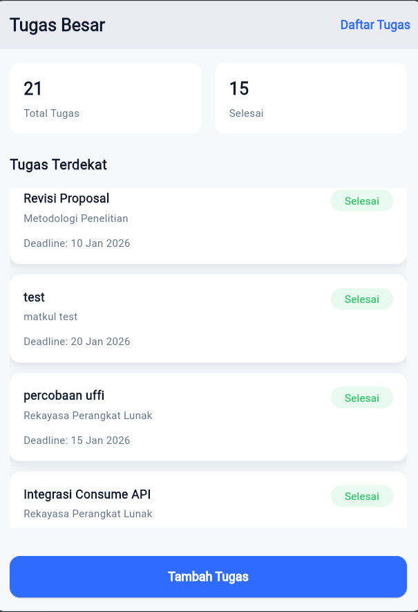
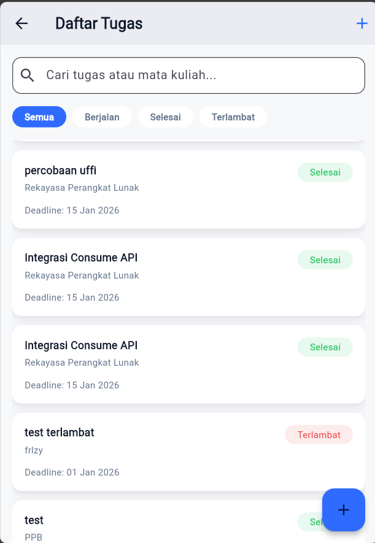
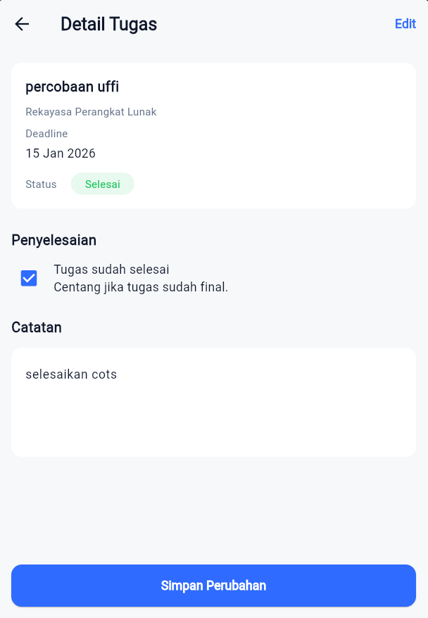
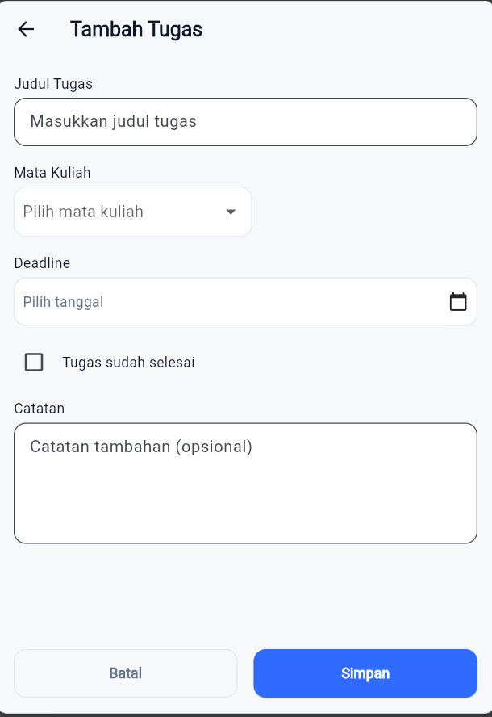

## COTS - Aplikasi Manajemen Tugas Besar

Project ini adalah aplikasi Flutter untuk manajemen tugas besar perkuliahan.
Pengguna dapat melihat ringkasan tugas, daftar semua tugas, melihat detail,
menambah tugas baru, serta mengubah status dan catatan tugas yang tersimpan
di backend Supabase.

---

## Fitur Utama

- **Dashboard (Beranda)**

  - Ringkasan jumlah total tugas dan tugas yang sudah selesai.
  - Daftar tugas terdekat dengan status (Berjalan, Selesai, Terlambat).

- **Daftar Tugas**

  - Menampilkan semua tugas dari Supabase.
  - Filter berdasarkan status: Semua, Berjalan, Selesai, Terlambat.
  - Navigasi ke halaman detail tugas.

- **Detail Tugas**

  - Menampilkan informasi lengkap tugas (judul, mata kuliah, deadline, status).
  - Mengubah status tugas (checkbox "Tugas sudah selesai").
  - Mengubah/menyimpan catatan tugas (PATCH ke API Supabase).

- **Tambah Tugas**
  - Form untuk membuat tugas baru (judul, mata kuliah, deadline, status, catatan).
  - Data tersimpan ke Supabase dan halaman sebelumnya akan otomatis refresh.

---

## Teknologi yang Digunakan

- **Framework**: Flutter
- **Bahasa**: Dart
- **Backend**: Supabase REST API (`/rest/v1/tasks`)
- **HTTP Client**: `http` package
- **Arsitektur**:
  - `lib/design_system` untuk warna, tipografi, dan spacing.
  - `lib/models` untuk model data (`Task`).
  - `lib/services` untuk komunikasi API (`TaskApiService`).
  - `lib/presentation/pages` untuk halaman-halaman utama.
  - `lib/presentation/widget` untuk widget reusable (mis. `TaskCard`, status chip).

---

## Struktur Folder Utama

```text
lib/
	config/
		supabase_config.dart      # Konfigurasi base URL & anon key Supabase
	models/
		task.dart                 # Model Task yang merepresentasikan tabel tasks
	services/
		task_api_service.dart     # Service untuk GET/POST/PATCH ke Supabase
	design_system/
		colors.dart
		typography.dart
		spacing.dart              # Konstanta desain (warna, teks, spacing)
	presentation/
		pages/
			dashboard_page.dart     # Halaman Dashboard / Beranda
			task_list_page.dart     # Halaman Daftar Tugas
			task_detail_page.dart   # Halaman Detail Tugas
			add_task_page.dart      # Halaman Tambah Tugas
		widget/
			task_card.dart          # Kartu tampilan tugas
			task_status_chip.dart   # Chip status tugas (Berjalan/Selesai/Terlambat)
	main.dart                   # Entry point aplikasi & routing
```

---

## Cara Menjalankan Project

Pastikan sudah menginstall Flutter SDK dan mengkonfigurasi Supabase (base URL
dan anon key) di `lib/config/supabase_config.dart`.

1. Install dependency:

   ```bash
   flutter pub get
   ```

2. Jalankan aplikasi (contoh ke device/web yang tersedia):

   ```bash
   flutter run
   ```

3. Pilih device (Android/emulator, iOS/simulator, Windows, Chrome, dsb.).

---

## Screenshot Aplikasi

### 1. Dashboard



### 2. Daftar Tugas



### 3. Detail Tugas



### 4. Tambah Tugas



---

## Created by Ahmad Uffi COTS TUBES PBB
